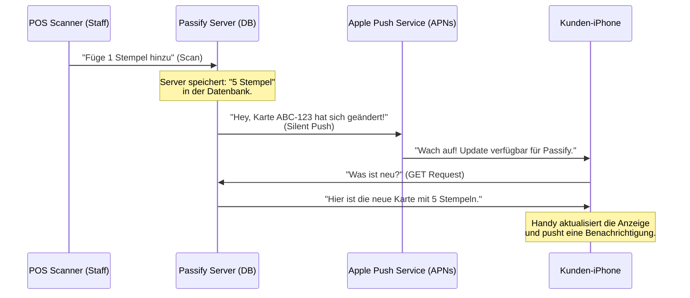

# Passify Systemarchitektur & Datensicherheit

Dieses Dokument erklärt, wie Passify funktioniert, wo die Daten liegen, wie Updates auf das Handy kommen und warum die Daten sicher sind.

## 1. Das Konzept: Die "Wahrheit" liegt in der Datenbank

Eine der wichtigsten Ängste war: *"Was ist, wenn der Kunde die Karte löscht? Sind die Stempel weg?"*
**Antwort: Nein.**

Das System funktioniert nach dem **Client-Server-Prinzip**:
*   **Der Server (Passify Database):** Hier liegt das "Gehirn". In der Tabelle `passes` steht z.B., dass Karte `ABC-123` genau **4 Stempel** hat. Das ist die einzige Wahrheit.
*   **Das Handy (Apple/Google Wallet):** Das ist nur ein "Bildschirm". Es zeigt an, was der Server ihm sagt.

Wenn ein Kunde die Karte löscht, löscht er nur die "Anzeige". Die Daten (4 Stempel) bleiben sicher in deiner Datenbank. Sobald der Kunde die Karte neu hinzufügt (z.B. über denselben Link oder QR-Code), fragt das Handy den Server: *"Wie viele Stempel habe ich?"* und der Server antwortet: *"4!"*.

## 2. Wie funktionieren Push-Updates? (Das "Dreieck")

Du hast gefragt, wie die Push-Mitteilung technisch funktioniert. Es ist ein Prozess über drei Ecken:

### Der Ablauf im Detail (Code-Ebene):
1.  **Scan:** In `api/scan/route.ts` wird der Scan empfangen.
2.  **Save:** Der Server speichert den neuen Stand (z.B. 5 Stempel) in der `passes`-Tabelle. **Ab hier sind die Daten sicher.** Selbst wenn alles andere abstürzt, ist der Stempel gespeichert.
3.  **Trigger:** Der Server schaut in die Tabelle `device_registrations`. Dort stehen die "Adressen" (Push Tokens) aller Handys, die diese Karte installiert haben.
4.  **Send:** Der Server sendet ein winziges Signal an Apple/Google: *"Update verfügbar"*.
5.  **Fetch:** Das Handy des Kunden wacht im Hintergrund auf, lädt die neue Karte herunter und zeigt sie an.

## 3. Datensicherheit & Backups

Du möchtest 10.000+ Kunden verwalten. Da darf nichts verloren gehen.

### A. Wo liegen die Daten?
Die Daten liegen in einer **Supabase PostgreSQL Datenbank**. Das ist ein Industriestandard.
*   **Tabelle `passes`**: Der aktuelle Stand (Stempel, Punkte).
*   **Tabelle `clients`**: Deine Firmenkunden.
*   **Tabelle `scans`**: Ein Protokoll *jeder* Transaktion. Wenn also mal etwas "komisch" aussieht, kannst du genau nachvollziehen: *"Am 12.12. um 14:00 Uhr wurde gescannt"*.

### B. Wie entsteht die .pkpass Datei? (Die "Bäckerei")

Du hast gefragt, wo die Datei gespeichert wird. Die Antwort ist: **Nirgends.** Sie wird "frisch gebacken".

Das System nutzt das **Rezept-Prinzip**:
1.  **Das Rezept (Datenbank):** In der `campaigns`-Tabelle steht: *"Hintergrund ist Blau (#0000FF), Logo ist `logo.png`, Text ist 'Willkommen'"*.
2.  **Die Zutaten (Storage):** Die Bilder (Logo, Strip-Image) liegen sicher im Cloud-Speicher (Supabase Storage).
3.  **Der Bäcker (Server-Code):** Wenn ein Kunde den QR-Code scannt, passiert Folgendes in Millisekunden:
    *   Server holt das Rezept und die Zutaten.
    *   Server "backt" daraus die `.pkpass`-Datei (das ist technisch eine ZIP-Datei mit `pass.json` und Bildern).
    *   Server unterschreibt sie mit deinem digitalen Apple-Zertifikat (Sicherheitssiegel).
    *   Server gibt die frische Datei ans Handy.

**Warum ist das genial?**
Weil du keine 10.000 Dateien sichern musst. Du musst nur **das eine Rezept** sichern. Wenn du das Design änderst (z.B. neues Logo), wird beim nächsten Update für *alle* Kunden automatisch die neue Version "gebacken".

## 3. Datensicherheit & "Super-GAU" Szenarien

Du möchtest wissen: *"Was ist, wenn die App kaputt geht? Kann ich alles rekonstruieren?"*

### A. Wo liegen die Daten?
Die Daten liegen in einer **Supabase PostgreSQL Datenbank**. Das ist ein Industriestandard.
*   **Tabelle `passes`**: Der aktuelle Stand (Stempel, Punkte).
*   **Tabelle `clients`**: Deine Firmenkunden.
*   **Tabelle `campaigns`**: Das komplette Design & Konfiguration.
*   **Tabelle `device_registrations`**: Die "Adressbücher" der Kunden-Handys (Push Tokens).

### B. Szenario: Die "Passify App" wird gelöscht / Server brennt ab
Stell dir vor, dein Code ist weg. Aber deine **Datenbank (Supabase)** existiert noch (dank Backups).
*   **Müssen Kunden neu scannen? NEIN.**
*   **Warum?** Das Handy des Kunden versucht regelmäßig, deinen Server unter der Adresse `api.passify.io` (Beispiel) zu erreichen.
*   **Die Rettung:** Wir installieren den "Bäcker"-Code einfach neu auf einem neuen Server und geben ihm wieder die Adresse `api.passify.io`.
*   **Das Ergebnis:** Die Handys der Kunden merken gar nicht, dass der Server weg war. Sie klopfen an, der neue Server antwortet (weil er die Daten aus der Datenbank hat), und alles läuft weiter.

### C. Backup-Strategie & Empfehlung
Da wir Supabase nutzen, haben wir folgende Sicherheitsnetze:
1.  **Daily Backups:** Supabase macht automatisch tägliche Backups der gesamten Datenbank.
2.  **Point-in-Time Recovery (PITR):** (Empfohlenes Upgrade) Damit kannst du die Datenbank auf *jede beliebige Sekunde* der letzten 7 Tage zurücksetzen.
3.  **Export:** Du kannst jederzeit einen "Dump" (komplette Kopie) der Datenbank ziehen.

## 4. FAQ: Deine Fragen im Detail

**Q: Fragt das Handy bei jedem Öffnen die Datenbank?**
A: Nein, das wäre zu langsam und würde Akku fressen.
*   Das Handy speichert die Karte ("Cache").
*   Es fragt nur nach Updates, wenn:
    1.  Wir einen **Push** senden (Server -> Handy).
    2.  Der Kunde die Karte manuell aktualisiert (in der Wallet "Herunterziehen").
    3.  Das Gerät "Automatische Updates" aktiviert hat (passiert sporadisch im Hintergrund).

**Q: Hat jeder Kunde eine eindeutige Nummer?**
A: **JA.**
*   In der Datenbank (Tabelle `passes`) hat jeder Pass eine `serial_number` (z.B. `123e4567-e89b...`).
*   Diese Nummer ist fest in die `.pkpass`-Datei "eingebacken".
*   Wenn das Handy sich meldet, sagt es: *"Hallo, ich bin Nummer 123e4567..."* und der Server weiß sofort, wem er antwortet.

**Q: Wenn der Code weg ist, sind die Push-Verbindungen weg?**
A: **NEIN.**
*   Die Verbindung besteht aus: `Push Token` (Adresse des Handys) + `Zertifikat` (Generalschlüssel).
*   Die Tokens liegen in der Datenbank (`device_registrations`).
*   Das Zertifikat hast du sicher als Datei gespeichert (und es liegt bei Apple im Developer Account).
*   Solange du Datenbank + Zertifikat hast, kannst du den Kunden erreichen. Der Code ist austauschbar.

## 4. Szenarien-Check

*   **Szenario: App wird gelöscht.**
    *   *Folge:* Kunde verliert temporär den Zugriff.
    *   *Lösung:* Kunde scannt QR-Code neu -> Karte ist wieder da, mit allen Stempeln.
*   **Szenario: Technischer Fehler beim Push.**
    *   *Folge:* Kunde sieht "4 Stempel" statt "5" auf dem Display.
    *   *Sicherheit:* In der Datenbank stehen aber korrekt "5".
    *   *Lösung:* Beim nächsten Öffnen oder "Pull-to-Refresh" aktualisiert sich die Karte. Nichts geht verloren.
*   **Szenario: Dein Laptop geht kaputt.**
    *   *Folge:* Keine. Der Server läuft in der Cloud (Vercel/Supabase).

## Zusammenfassung
Das System ist so gebaut, dass das Handy nur ein "dummes" Anzeigegerät ist. Die wertvollen Daten liegen sicher und zentral in der Datenbank. Solange die Datenbank läuft (und Supabase ist sehr zuverlässig), sind die Kundendaten sicher.
